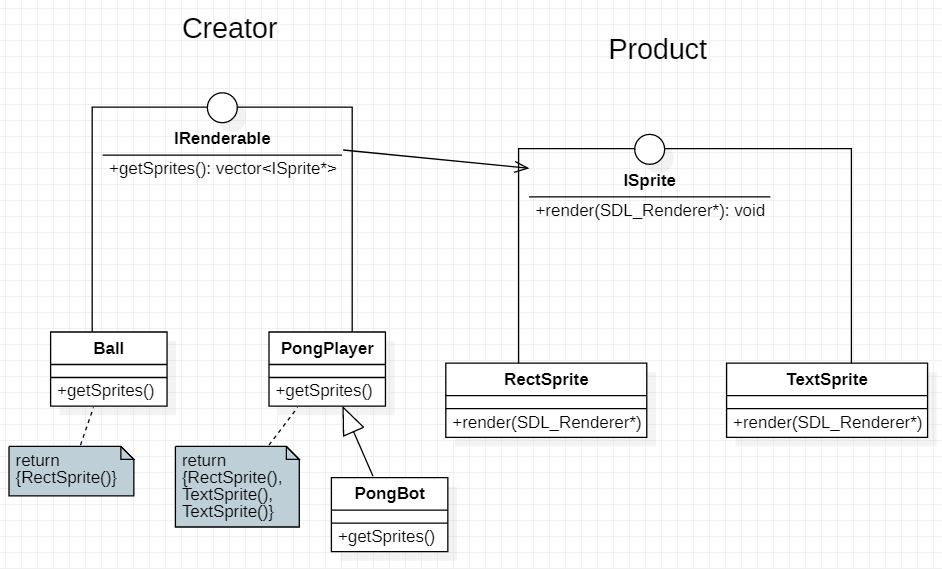
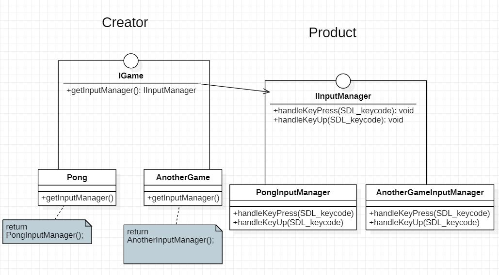

# PongSDL2
Classic Pong using SDL2. <p><p>

### Getting started
Just launch `cmake-build-release/Pong.exe`. <p>
There are two modes of playing available: "player vs player" or "player vs bot".
The former is the default mode.
To activate the latter, you can pass a command line argument "`BOT`": 
```
> Pong.exe BOT
```
##### Additional info:
The project was built and compiled using SDL2 v2.0.12, SDL2_ttf v2.0.15 and MinGW for ~~Windows x64~~.\
 [**UPD:** I rebuilt the project using mingw32 and SDL2 version i686. Now it should run on Win32.\
  For built Win64 app, see the previous commit.]
<p><p><p>

### Requirements:
- [x] use only SDL2
- [x] implement a game bot
- [x] provide a README overview file

1. ##### Demonstrate C++ knowledge (not C) 
    * variadic templates with fold expressions in `utility/Logger.hpp`:
    ```c++
    template<typename... Args>
    static void logMessage(const Args&... args)
    {
        (std::cout << ... << args) << "\n";
    }
    ```

    * shared_ptr (e.g. in `GameManager::_instance`, `Pong::players`)
    * structured binding `auto[dx, dy]` : `CollisionDetector`
    * random using `std::mt19937` and `std::uniform_int_distribution` in `Random`

2. ##### Demonstrate OOP knowledge and the ability to use it
     The architecture was designed based on small single-purposed classes that encapsulate data.\
     The architecture relies on the use of interfaces and inheritance.\
     Which also gives chances to leverage the power of polymorphism.\
     The code follows RAII principle, favors containers and wrappers like smart pointers.\
  
3. ##### Demonstrate the ability to use STL
     The needs of my project regarding STL don't go much further than `std::vector` and `std::pair`.
4. ##### Neatly structured code
     The classes of the project are divided according to the Model-View-Controller pattern, conveniently separated into categorical folders.\
     Alongside them, there is a group of helper classes in "/utility/".
5. ##### Demonstrate the ability to include and use external libraries
     The project uses SDL2 and SDL2_ttf libraries. It also makes it possible to easily include SDL2_image and SDL2_mixer.\
     The libraries are linked with automatic scripts.\
     See CMakeLists.txt for details.
6. ##### Demonstrate familiarity with the architecture of game engines
     Class `controller/GameManager` provides a wrapper around (any) game. `GameManager::run()` describes the main game loop:
    ```c++
    while (mainWindow.isOpen())
    {
            ...   
            processFrame();
            ...
    }
    ...
    void GameManager::processFrame()
    {
        mainWindow.handleEvents(game->getInputManager());
        game->updateGameLogic();
        mainWindow.render(game->getRenderedEntities());
    }
    ```
   Class `view/GameWindow` handles the graphical tasks specifically. It initializes and frees resources in it's constructor/destructor, 
   polls the event queue, and implements the update of the double-buffered renderer.
7. ##### Apply some of Design Patterns (not only a Singleton)
    - **Factory**: 
    The client code (rending window) knows only about the interface `ISprite`, inheritants of which are created on the factories inhereting "IRenderable". <p>
    - **Singleton**: class `GameManager` is a singleton, and can handle any kind of game (declared by `IGame`). We don't need more than one instance. <p>
    - **Factory2**: 
    IGame creates IInputManagers. As we have an abstract `GameManager`, it's nice to prepare the project for other games. And every game needs its own input manager to handle events. <p>
    - **MVC pattern**. And the controller classes are a kind of **Mediators**.
8. ##### The code has to compile under Win32, Ubuntu 16.04 x64 or 18.04 x64 or it has to be run with an executable file.
     The game can be started by running `Pong.exe [BOT]`. 
